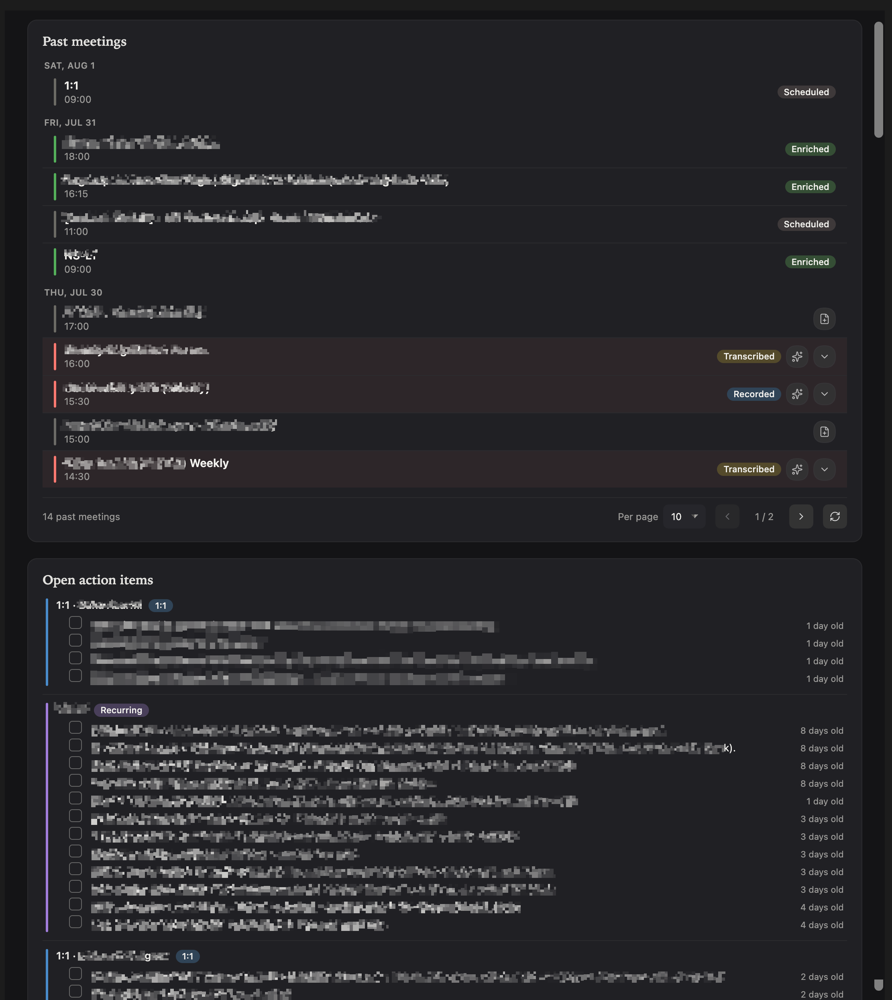

# Meeting Copilot

Granola-style meeting capture for Obsidian on macOS: Google Calendar → dual-channel recording → transcription (remote or on-device Whisper) → AI enrichment.



## Installation

**BRAT (recommended):** install [BRAT](https://github.com/TfTHacker/obsidian42-brat), then add:

```
alvarolobato/obsidian-meeting-copilot
```

**Manual:** download `main.js`, `manifest.json`, and `styles.css` from the [latest release](https://github.com/alvarolobato/obsidian-meeting-copilot/releases/latest) into `.obsidian/plugins/meeting-copilot/`, then enable the plugin.

On first recording, the `system-recorder` helper (and its `whisper` runtime) download automatically. Grant the macOS prompts, then quit and reopen Obsidian.

Optional: [Dataview](https://github.com/blacksmithgu/obsidian-dataview) (dashboard), [Tasks](https://github.com/obsidian-tasks-group/obsidian-tasks) (action-item tracking).

See [Setup](docs/setup.md) for Google Calendar, AI endpoint, transcription, and enrichment.

## Features

- Dual-channel recording (system audio + mic)
- Google Calendar sync and agenda sidebar
- Auto notes, transcript, and AI enrichment
- Local on-device Whisper (optional)
- Meetings dashboard and recording retention

## More

- [Setup](docs/setup.md) — calendar, endpoint, transcription, enrichment, usage
- [Development](docs/development.md) — build, release, debugging
- [Organizing meeting notes](docs/organizing-meeting-notes.md)

## Requirements

- macOS 13.3+ (Apple Silicon)
- Obsidian Desktop
- Google account (calendar)
- OpenAI-compatible endpoint (local or remote) when you use enrichment and/or remote transcription. Not needed for on-device Whisper with enrichment off.

## Network use

Meeting Copilot talks to these remote services, only for the features you enable:

- **Google Calendar API** — reads your calendar (read-only) to build the agenda.
- **Google Cloud Identity Groups API + People API** — expands Google Group invitees into individual people and resolves their display names (read-only; see [Setup](docs/setup.md)).
- **OpenAI-compatible endpoint** (your choice of provider, local or remote) — used for remote transcription and AI enrichment, only if you configure one. Not needed for on-device Whisper with enrichment off.
- **GitHub Releases** — downloads the `system-recorder` helper binary, its `whisper` runtime, and (on demand) local Whisper models the first time each is needed.

OAuth tokens and any client secret are stored in per-vault local storage on your device, never in synced `data.json`.

## Attribution

Meeting Copilot builds on generously-licensed open-source work:

- Base project and dual-channel ScreenCaptureKit recorder + Google Calendar integration: **[System Recording](https://github.com/yut0takagi/obsidian-system-recording)** by **Yuto Takagi** (0BSD).

See [`THIRD_PARTY_NOTICES.md`](THIRD_PARTY_NOTICES.md) for full credits.

## License

0BSD — see [`LICENSE`](LICENSE) and [`THIRD_PARTY_NOTICES.md`](THIRD_PARTY_NOTICES.md).
