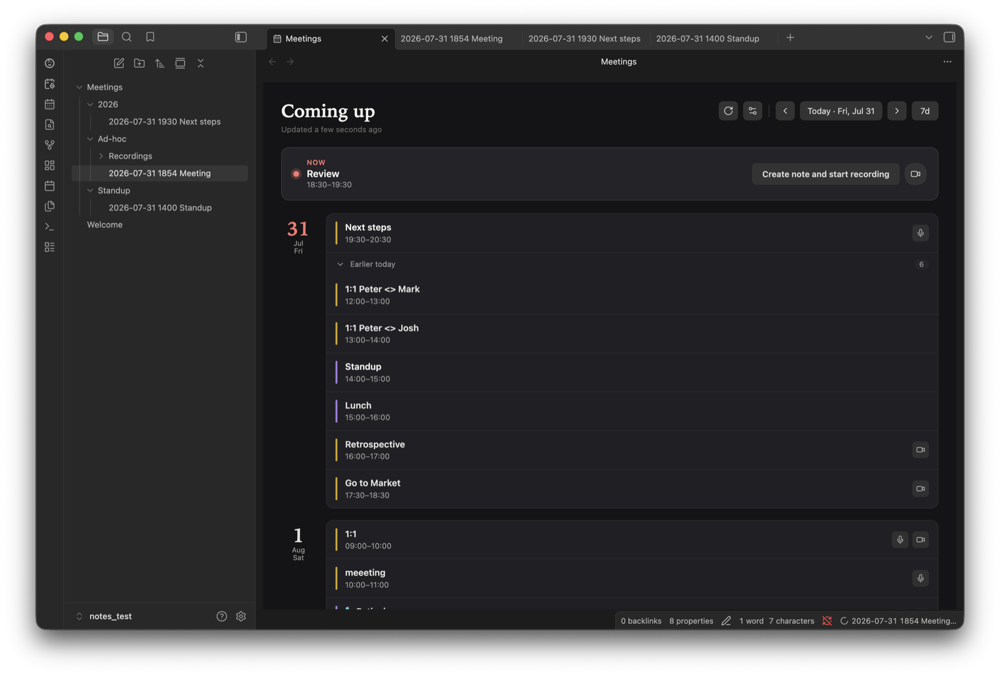

# Meeting Copilot

Integrated meeting transcription, note-taking, and summarization for Obsidian on macOS: Google Calendar → dual-channel recording → transcription (remote or on-device Whisper) → AI summaries.



## Installation

**Community plugins:** in Obsidian, open *Settings → Community plugins → Browse*, search for **Meeting Copilot**, then install and enable it.

**BRAT (beta builds):** install [BRAT](https://github.com/TfTHacker/obsidian42-brat), then add:

```
alvarolobato/obsidian-meeting-copilot
```

**Manual:** download `main.js`, `manifest.json`, and `styles.css` from the [latest release](https://github.com/alvarolobato/obsidian-meeting-copilot/releases/latest) into `.obsidian/plugins/meeting-copilot/`, then enable the plugin.

On first recording, the plugin downloads its `system-recorder` helper and `whisper` runtime (see [Helper downloads](#helper-downloads)). Grant the macOS prompts, then quit and reopen Obsidian.

Optional: [Tasks](https://github.com/obsidian-tasks-group/obsidian-tasks) (action-item tracking). The meetings dashboard and agenda are both built-in views — no Dataview or other query plugin needed.

See [Setup](docs/setup.md) for Google Calendar, AI endpoint, transcription, and enrichment.

## Features

- Dual-channel recording (system audio + mic)
- Google Calendar sync and agenda sidebar
- Auto notes, transcript, and AI enrichment
- Local on-device Whisper (optional)
- Meetings dashboard and recording retention

## More

- [Setup](docs/setup.md) — calendar, endpoint, transcription, enrichment, usage
- [Development](docs/development.md) — build, release, debugging
- [Organizing meeting notes](docs/organizing-meeting-notes.md)
- [Privacy policy](docs/privacy-policy.md) and [terms of service](docs/terms-of-service.md)

## Requirements

- macOS 13.3+ (Apple Silicon)
- Obsidian Desktop
- Google account (calendar)
- OpenAI-compatible endpoint (local or remote) when you use enrichment and/or remote transcription. Not needed for on-device Whisper with enrichment off.

## Network use

Meeting Copilot talks to these remote services, only for the features you enable:

- **Google Calendar API** — reads your calendar (read-only) to build the agenda.
- **Google Cloud Identity Groups API + People API** — expands Google Group invitees into the individual people on the group, then resolves those people's display names from your Workspace directory — read-only, each independently toggleable under Advanced settings (on by default); see [Setup](docs/setup.md).
- **OpenAI-compatible endpoint** (your choice of provider, local or remote) — used for remote transcription and AI enrichment, only if you configure one. Not needed for on-device Whisper with enrichment off.
- **AI command-line tool** (optional) — if you pick Claude Code, Codex, OpenCode, or pi as the enrichment backend, the plugin runs that tool on your Mac, and the tool sends the note to its own provider.
- **GitHub Releases** — downloads the `system-recorder` helper, its `whisper` runtime, and the `fvad.wasm` voice-activity detector the first time each is needed (see [Helper downloads](#helper-downloads)).
- **Hugging Face** — downloads the on-device Whisper model you pick (from [`ggerganov/whisper.cpp`](https://huggingface.co/ggerganov/whisper.cpp)), only when you use local transcription.

The plugin has no server of its own and collects no telemetry. See the [privacy policy](docs/privacy-policy.md).

## Helper downloads

Obsidian installs only `main.js`, `manifest.json`, and `styles.css`. Recording and on-device transcription need native macOS code, so the plugin downloads these files into its own plugin folder (`.obsidian/plugins/meeting-copilot/`) the first time they're needed:

| File | What it is | Downloaded from | When |
| --- | --- | --- | --- |
| `system-recorder` | Swift helper that records system audio and the mic, lists microphones, and runs on-device transcription ([source](swift-helper/)) | This repository's GitHub release for the installed plugin version | First recording, or refreshing the microphone list in settings |
| `whisper` | whisper.cpp runtime library the helper links | Same release | With the helper |
| `fvad.wasm` | WebRTC voice-activity detector ([`@echogarden/fvad-wasm`](https://www.npmjs.com/package/@echogarden/fvad-wasm)) | Same release | First transcription that separates your voice from others |
| `models/*.bin` | On-device Whisper model | Hugging Face | When you press *Download* under *Settings → Transcription*, or on the first local transcription |

- **Checksum-verified.** Every download is checked against a SHA-256 checksum built into that plugin version, and discarded if it doesn't match. The recorder helper is re-checked each time it's used. The other files are re-downloaded if their size changes.
- **Pinned to the plugin version.** The plugin never fetches a "latest" build. The helper only changes when you update the plugin itself; models are downloaded once and reused.
- **Built in the open.** Release files are built from this repository by [GitHub Actions](.github/workflows/release.yml) and carry signed build provenance. Check one with `gh attestation verify system-recorder -R alvarolobato/obsidian-meeting-copilot`.
- **Visible.** A notice shows while the helper or runtime downloads. Model download progress shows in settings.

## File and system access

Meeting Copilot is desktop-only and uses Node.js APIs beyond Obsidian's vault API. It uses them only for the following.

**Filesystem**

- **Plugin folder** — stores the helper files and models listed above, plus `directory-cache.json`: the Google Workspace names and group members already looked up, so they aren't requested again. It syncs to your other devices if you sync `.obsidian/plugins`.
- **System temp folder** — short-lived working files while recording, transcribing, and running an AI command-line tool, removed afterwards.
- **Your vault** — recordings, transcripts, and meeting notes are saved in the vault folders you configure.

**Processes**

- **`system-recorder`** — records audio, lists microphones, and runs on-device transcription.
- **`pgrep`** — checks whether a Zoom call is running (the `CptHost` process). Runs every 10 seconds while meeting detection and Zoom detection are on (both on by default).
- **`osascript`** — checks Chrome, Brave, Edge, or Arc tabs for an active Google Meet call, only when Google Meet detection is on (off by default). macOS asks once for Automation permission.
- **Your AI command-line tool** (`claude`, `codex`, `opencode`, or `pi`) — only if you pick one as the enrichment backend: to enrich notes and to list its models. The plugin looks for it on your `PATH`, in common install folders in your home directory, and in npm's global folder (found with `npm config get prefix`).
- **`open`** — opens the Notifications or Screen & System Audio Recording pane in macOS System Settings, when you use the button that offers to.

**Local network listener**

- **Google sign-in** — while you sign in, a temporary web server listens on `127.0.0.1` (a random port, not reachable from other machines) to receive the callback from your browser. It closes as soon as sign-in finishes or is cancelled.

**Obsidian and browser APIs**

- **Vault-wide file list** — finds meeting notes for the agenda, dashboard, and notes-with-issues list, matches recordings to their notes, and finds old recordings for retention cleanup.
- **Clipboard** — writes a meeting link when you choose *Copy meeting link*. It never reads the clipboard.
- **Local storage** — Google OAuth tokens and any client secret are kept in Obsidian's per-vault local storage, so they're never written to the synced `data.json`. All other settings use the normal plugin data file.

**macOS permissions** — Microphone and Screen & System Audio Recording for the helper, Automation for Google Meet detection, and Notifications for meeting prompts.

## Attribution

Meeting Copilot is an integrated meeting workflow built from permissively licensed open-source parts. It **vendors and adapts code** from the projects below — you do **not** need to install them separately. Full license texts are in [`THIRD_PARTY_NOTICES.md`](THIRD_PARTY_NOTICES.md).

| Component | Source | Author | License | What we use |
|-----------|--------|--------|---------|-------------|
| Recorder & calendar | [System Recording](https://github.com/yut0takagi/obsidian-system-recording) | Yuto Takagi | 0BSD | Dual-channel ScreenCaptureKit recorder (`swift-helper/`), Google Calendar integration, and parts of the core plugin scaffolding |
| Agenda sidebar | [Meetings Plus](https://github.com/jabaho9523/obsidian-meetings-plus) | Jacob Holm | 0BSD | Meeting agenda view (day grouping, meeting rows, status header, date picker, and related UI/styles) |
| Remote transcription | [AI Transcriber](https://github.com/mssoftjp/obsidian-ai-transcriber) | Musashino Software | MIT | Transcription engine under `src/transcribe/vendor/` (audio chunking, VAD, Whisper/GPT-4o clients, cleaners, transcript merge, dictionary correction). Driven headlessly by Meeting Copilot — no AI Transcriber plugin required |

**Not from AI Transcriber:** on-device Whisper transcription runs in Meeting Copilot's own `system-recorder` Swift helper (whisper.cpp over Metal), not the vendored engine above.

## License

0BSD — see [`LICENSE`](LICENSE) and [`THIRD_PARTY_NOTICES.md`](THIRD_PARTY_NOTICES.md).
